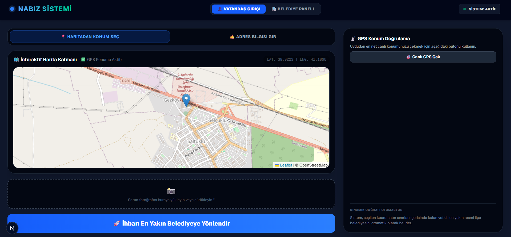
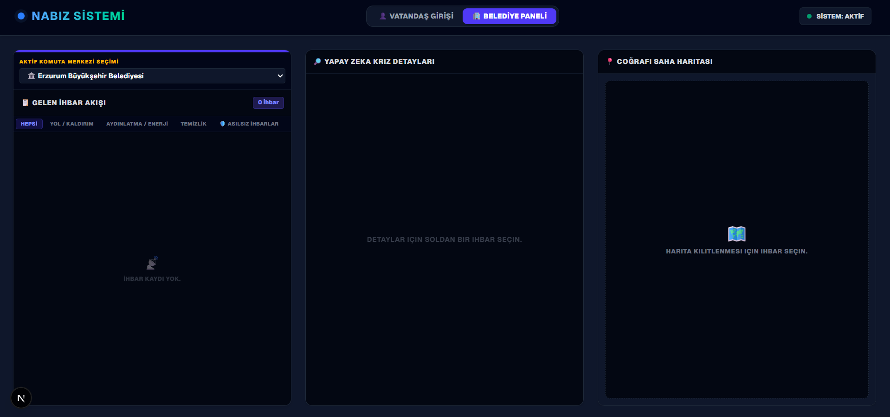

# NABIZ – Proaktif Kent Zekâ Sistemi

Nabız, Kentteki sorunları daha hızlı çözmek için gelştirildi.

## Avantajları 
- Yapay zeka destekli olduğu için kısa sürede duruma karar verebiliyor.
- En yakın belediyeye bildirerek sorunu çözmek için belediye harekete geçiyor.

## Çalışma şekli
- Gemini 2.5 alt tabanlı geliştirildi.
- Gemini resmi analiz ederek sorun varmı yok mu tespiti yapıyor.

## Kullanıcı Ekranı

## Belediye Ekranı
